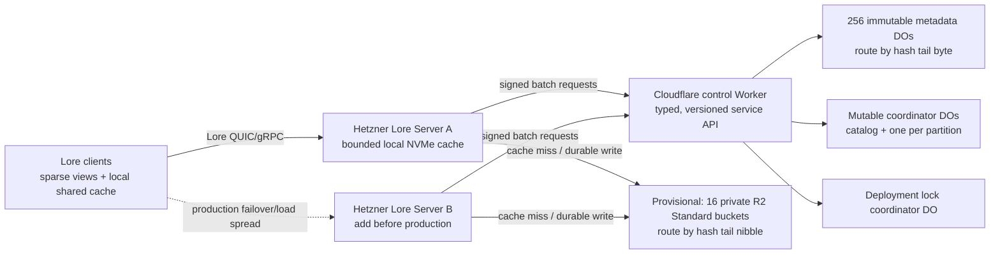

<!-- SPDX-FileCopyrightText: 2026 Digital Wanderer Sp. z o.o. -->
<!-- SPDX-License-Identifier: MIT -->

# Archigma Lore on Cloudflare and Hetzner

Status: **proposed; not production-validated**

Last reviewed: **2026-07-31**

Target: one approximately 10 TB repository, growth to 50 TB, about 80 concurrent users

Review basis: the local `0.8.7-nightly` fork at commit `75a252fe`, Lore's published `0.8.5`
documentation, the accepted storage/plugin ADRs, the current store traits, and Cloudflare and
Hetzner platform documentation available on the review date.

## Decision summary

Use Lore's existing server and storage interfaces, but replace the staging DynamoDB-over-D1
compatibility gateway with a native Cloudflare backend:

- R2 Standard stores immutable fragment payloads, one object per content hash, with a provisional
  16-bucket mapping to be frozen after the pre-ingest capacity benchmark.
- SQLite-backed Durable Objects store immutable metadata and partition/context associations.
- Dedicated SQLite-backed Durable Objects implement the mutable store and lock store with Lore's
  exact compare-and-swap and batch-atomic lock semantics.
- A derived Lore Server binary registers the Cloudflare stores as plugins, following
  [ADR-00013](../../docs/developing/decisions/00013-plugin-dependency-strategy.md).
- One Hetzner server with a local NVMe LRU cache is the initial test environment. Add a second active
  server before production rollout.
- Lore's current QUIC/gRPC protocols remain the only client data path. Fragment bytes always pass
  through a Lore Server; there is no custom Cloudflare client data plane.

The current D1 gateway is useful as a staging proof of concept only. It must not be promoted as the
50 TB / 80-user production metadata architecture.

## What changed after the Lore architecture review

| Earlier idea | Verdict | Corrected decision |
| --- | --- | --- |
| R2 as durable payload storage | Compatible | Keep it. R2 is an S3-compatible object store and fits Lore's replaceable immutable-store boundary. |
| D1 emulating DynamoDB | Works for a small POC, not the target hot path | Replace it with a domain-specific Cloudflare store API and Durable Objects. Do not keep paying the latency and complexity of translating DynamoDB's wire protocol. |
| 256 hash-sharded immutable metadata objects | Compatible as an internal backend detail | Keep the idea behind `ImmutableStore`; do not expose physical shards to Lore clients or describe it as Lore's not-yet-implemented native server sharding. |
| One mutable shard per branch | Unnecessary and awkward for `list` | Use one mutable coordinator per non-null partition plus a catalog coordinator for the default partition. CAS contention is already per key. |
| Lock shard per file | Incompatible | Use one deployment lock coordinator initially. Lore requires an entire requested resource set to lock or unlock atomically, and lock queries can cross repositories. |
| Direct R2 presigned URLs for clone/sync | Incompatible with stock Lore and risky | Do not use them for ordinary users. Lore's current presigned endpoint is service-account-only and still streams through Lore Server. Keep all ordinary fragment transfer on Lore's supported transports. |
| Packfiles sent to clients | Incompatible | Keep Lore's one-fragment-per-command wire contract. Packfiles may only become a private backend optimization after a separate ADR and benchmark. |
| Stateless Fly machines without cache | Valid but poorly matched to this workload | Replace Fly with Hetzner servers and bounded local NVMe caches. This restores Lore's documented edge-cache shape without making local disks durable storage. |
| One giant monorepo | Compatible only with one access boundary | Keep one repository only if every authorized user may read every path. Lore has no per-path ACL inside a partition; protected directories must become linked repositories. |

## Lore invariants this design must preserve

The relevant sources of truth are the
[system design](../../docs/explanation/system-design.md),
[`ImmutableStore`](../../lore-storage/src/immutable_store.rs),
[`MutableStore`](../../lore-storage/src/mutable_store.rs), and
[`LockStore`](../../lore-revision/src/lock.rs) contracts.

### Partitions remain the access boundary

One Lore repository is one partition. The authenticated session, not a client-supplied parameter,
determines the partition. Knowing a BLAKE3 hash must never be sufficient to read bytes: an exact
association for the session's partition and requested context must exist.

Physical payload deduplication may cross partitions, but authorization may not. Any Cloudflare data
service must check the current association before every payload response. This is why a bearer URL
directly to `https://<account>.r2.cloudflarestorage.com/<hash>` is not acceptable for normal clone
or sync.

### Immutable-store behavior is more than blob get/put

The Cloudflare implementation must preserve:

- `MatchNone`, hash, partition, and full partition/context match behavior;
- single and batch existence queries with result order preserved;
- fragment metadata validation and the 256 KiB protocol payload ceiling;
- payload-less put when the hash already exists and only a new association is needed;
- copy between partitions/contexts without duplicating payload bytes;
- two-phase obliteration and typed obliterating/obliterated results;
- deletion of a shared R2 payload only when no valid association still needs it;
- `SlowDown` for transient overload, timeouts, R2 `429`, and retryable `5xx` responses;
- verify, heal, flush, compact, and lifecycle semantics required by the trait.

The failed D1 load test returned false `AddressNotFound` results for transient backend failures. That
is a correctness bug, not acceptable backpressure. Lore explicitly requires overload to make work
slower, never to produce a wrong answer.

### Mutable-store CAS stays atomic

The mutable store is small, but it owns branch latest pointers, repository names, and other
serialization points. `compare_and_swap` must be one SQLite transaction. A null/default partition
must retain Lore's catalog/list behavior; non-null partitions route to their repository coordinator.

Do not shard the mutable store by branch unless measured load proves it necessary and the complete
`load`, `store`, `compare_and_swap`, and `list` contract still has a simple implementation.

### Lock batches stay atomic

`lock_resources` must acquire every requested resource or none. `unlock_resources` has the same
all-or-nothing rule. A single SQLite transaction in one lock coordinator naturally provides this
for the current deployment and also supports repository-wide and owner-wide queries.

Lore's current locks are repository-wide and file-level. Branch-aware locking is documented as
future work, so the Cloudflare backend must not invent branch-scoped semantics. Lore's current
product-level locking is also advisory rather than fully enforced, and its global repository query
path is listed on the public roadmap as not yet scalable to very large deployments. Backend
atomicity therefore does not by itself make the complete locking workflow production-ready; test
the real Blender/user flow and track upstream locking work.

### The wire still carries individual fragments

Lore uses pipelined QUIC/gRPC commands, one fragment per command, with fragments no larger than
256 KiB. This provides fragment-level parallelism, dedup queries, verification, and resumability.
R2 packfiles must not leak into the client protocol.

## Target architecture



The Worker API is a private service boundary between the derived Lore Server and Cloudflare. It is
not a DynamoDB emulator. Requests are typed around Lore operations, versioned, bounded, signed,
and observable.

### Immutable metadata routing

Use 256 logical metadata shards from the start:

```text
metadata_shard = last_byte(blake3_hash)       # 0..255
payload_bucket = last_nibble(blake3_hash)     # 0..15
payload_key    = payloads/v1/<full_hash_hex>
```

Using tail bytes follows the direction in Lore's hash-sharding discussion while leaving front hash
bytes available for local on-disk fan-out. Routing is a private backend implementation detail. The
mapping version and shard counts become durable format decisions once real content is ingested; do
not change them without an online migration plan.

At a 64 KiB average fragment size, 50 TB is roughly 763 million fragments, or about 3 million hashes
per metadata shard before deduplication. This should fit under the current 10 GB SQLite limit per
Durable Object, but row size and association multiplication must be measured with a realistic
corpus. Alert before any shard reaches 70% of its storage limit.

Each metadata shard owns all metadata and all partition/context associations for its hashes. That
makes association checks, match specificity, shared-payload accounting, and obliteration decisions
shard-local and transactional.

### Batched operations are mandatory

The previous POC performed multiple remote D1 reads for every fragment. A 384 MiB Blender file with
4,632 fragments therefore generated thousands of high-latency database calls.

The native backend must instead:

- group `exist_batch` inputs by metadata shard;
- issue bounded parallel shard requests from the Rust plugin;
- return ordered results to Lore;
- combine exact association and fragment metadata lookup into one shard operation for `get`;
- avoid unbounded fan-out and apply exponential backoff with jitter;
- cap concurrency independently for metadata calls and R2 operations.

The initial concurrency values are benchmark inputs, not architecture constants.

### R2 payload writes

Keep R2 buckets private and use the Workers binding or S3-compatible API, never `r2.dev`.
One object per content hash matches the current AWS store's simple, self-healing model and preserves
global deduplication.

A put must never publish a readable association before the payload is durably present. The safe
order is payload first, then metadata and association. A crash can leave an unreferenced payload,
which verification/GC can remove; it must not leave an association that points to missing bytes.
Concurrent puts for the same hash are idempotent and retry R2 `429`/`5xx` as `SlowDown`.

Start with R2 Standard. Infrequent Access adds retrieval charges and higher operation prices, which
do not fit active working sets without measured evidence.

Sixteen buckets are a capacity hedge, not a cost optimization. Cloudflare documents bucket sharding
as a mitigation when high concurrency overwhelms one bucket. Before production ingest, compare one,
four, and sixteen buckets. If one bucket passes the 80-user test with margin, operational simplicity
may justify using one; whichever mapping is selected must then be frozen before ingest.

### Durable Object state

Use SQLite-backed Durable Objects. Persistent correctness state belongs in SQLite, never only in
JavaScript memory, because objects can be evicted or restarted. Schema changes and Worker-to-DO APIs
must be forward/backward compatible during rolling deployments.

Durable Objects are used for coordination and strong consistency, not for streaming fragment bytes.
The stateless Worker or Lore Server streams payloads from R2.

### Hetzner role and local cache

Hetzner runs the derived Lore Server binary and terminates Lore's supported client protocols. Start
the scale investigation on one server, then add a second active server before production for host
failure and maintenance. The servers are interchangeable because R2 and Durable Objects own all
durable state.

Each server keeps a bounded local Lore fragment cache on NVMe. A cache loss or full machine loss may
reduce performance while content warms again, but must not lose committed data. Start with 0.5-1 TB
usable cache per server and size it from the measured shared team working set and hit rate.

The default dedicated 1 Gbit/s uplink is the first benchmark target. Test the optional 10 Gbit/s
uplink only if server network saturation is the limiting factor. Hetzner's managed load balancer
supports TCP but not UDP: gRPC can sit behind it, while QUIC needs direct endpoints, DNS/topology
routing, or a separate UDP-capable ingress. Benchmark both Lore transports before selecting the
production ingress.

Before team rollout, configure trusted certificates and Lore JWT authentication/authorization.
WireGuard may protect administration, but ordinary user access must have a documented endpoint and
failover path.

## Phased delivery

### Phase 0: current Fly/D1 POC

Keep the D1/DynamoDB gateway only long enough to reproduce correctness and performance tests. Do not
ingest production-scale data into it.

### Phase 1: single-node Hetzner baseline

Provision one Hetzner server, deploy the current derived Lore Server, enable a bounded NVMe cache,
and run the 1/10/40/80-client ladder. The current D1 gateway can be used to establish a diagnostic
baseline, but any D1 latency or false-not-found result invalidates that run as a target-architecture
result.

### Phase 2: Lore-compatible Cloudflare backend

Build a Cloudflare store crate and derived server binary:

- native immutable, mutable, and lock store plugins;
- typed/versioned Worker API;
- Durable Object schemas and migrations;
- batched metadata operations;
- private R2 payload storage;
- exact error translation, especially transient failures to `SlowDown`;
- conformance, failure-injection, and end-to-end tests.

Clients remain unchanged. Reads follow R2 -> Hetzner Lore cache -> client on a miss and Hetzner cache
-> client on a hit. This milestone is the first result that can qualify the target architecture.

### Phase 3: production redundancy

Add a second active Hetzner server, exercise host loss during clone/sync/push, and validate the
chosen gRPC or QUIC ingress/failover path. The deployment is not production-ready while one physical
host is the only Lore protocol endpoint.

### Optional later work: backend payload packing

Consider internal R2 packfiles only if operation cost or small-object throughput is proven to be a
bottleneck. Lore's accepted early S3 ADR chose one object per fragment because packfiles introduce
distributed index, append, compaction, and hot/cold placement complexity. Any pack implementation
must remain invisible to clients and translate range reads back into individual Lore fragments.

## Monorepo and workstation model

Lore is designed for repositories too large to materialize in full. A 500 GB workstation checkout
with less than 100 GB of daily active data should use:

- a curated `.lore/view` per role or team;
- lazy materialization rather than a default full clone;
- a bounded local LRU fragment cache;
- one shared local store across clones where appropriate;
- `.loreignore` for generated Blender/editor artifacts that must never be committed.

The view is local and does not travel with the clone, so onboarding must install a team-approved view
before the first large sync. A full 500 GB cold clone is a disaster/capacity test, not the normal
daily workflow.

One monorepo also means one access boundary. If a vendor or team must not read a directory, move that
directory into its own Lore repository and mount it with a committed link. A view controls local
materialization, not authorization.

## Capacity and cost reality check

R2 Standard storage at current list pricing is approximately:

- 10 TB: about USD 150/month;
- 50 TB: about USD 750/month.

Small-object operations are also material. With a 64 KiB average and no deduplication, ingesting
10 TB is roughly 153 million object writes (about USD 687 of R2 Class A operations at list price),
while 50 TB is roughly 763 million writes (about USD 3,433). Reading 40 TB once is roughly 610
million object reads (about USD 220 of R2 Class B operations), before Worker and Durable Object
charges. These are order-of-magnitude estimates; compression, deduplication, actual fragment size,
retries, and cache hits change them.

Hetzner changes the server-side economics materially. A current entry dedicated server can include
64 GB RAM, two local NVMe devices, a dedicated 1 Gbit/s uplink, and unlimited traffic. A 10 Gbit/s
uplink currently adds EUR 43/month, includes 20 TB outbound, and charges roughly EUR 1/TB above it.
Exact server availability and price must be captured in the provisioning record.

R2 Internet egress is currently free, but that does not make aggregate bandwidth infinite. An
80-person simultaneous 500 GB cold materialization is 40 TB:

| Shared effective bandwidth | Ideal transfer time for 40 TB |
| --- | --- |
| 1 Gbit/s | about 3.7 days |
| 10 Gbit/s | about 8.9 hours |
| 25 Gbit/s | about 3.6 hours |

Protocol overhead and contention make real times longer. The office/VPN last mile may be the limit
before Cloudflare. Normal sparse syncs and content-addressed deltas should be much smaller.

## Acceptance gates

### Correctness

- Run a backend conformance matrix for every `ImmutableStore`, `MutableStore`, and `LockStore`
  operation and error.
- Prove batch result ordering and all match-specificity cases.
- Prove the knows-the-hash attack fails across partitions and contexts.
- Prove copy associates without uploading duplicate bytes.
- Prove lock and unlock batches are all-or-nothing under races and injected crashes.
- Prove mutable CAS has exactly one winner under contention and `list` remains complete.
- Prove shared hashes survive obliteration in another valid association, while the obliterated
  address returns its typed state.
- Inject Worker, DO, and R2 timeouts, overload, `429`, `5xx`, disconnects, and restarts. None may be
  reported as `AddressNotFound`.
- Verify every downloaded fragment by BLAKE3 and run Lore's repository verification/heal paths.

### Scale and throughput

Test realistic Blender data, including changed and partially changed `.blend` files, at 1, 10, 40,
and 80 concurrent clients. Run separate scenarios for:

- sparse first clone;
- 500 GB full materialization or a representative scaled equivalent;
- warm local-cache sync;
- daily 2-10 GB delta sync;
- simultaneous push of overlapping and non-overlapping assets;
- lock contention;
- machine restart and deployment during transfers;
- 24-hour mixed-operation soak.

Record aggregate and per-client throughput, p50/p95/p99 latency, error taxonomy, retries, DO shard
load/storage, R2 requests and `429`/`5xx`, Hetzner CPU/memory/disk/network, cache-hit rate, and
estimated cost per transferred TB. The gate is zero false not-found/corruption results and stable
completion at 80 clients; exact throughput targets should be set from the users' real network
baseline.

For the first server, run cold-cache and warm-cache passes at 1, 10, 40, and 80 clients. Keep client
stores isolated for the cold pass, prewarm the server cache for the warm pass, use the same corpus
and view in every run, and stop increasing concurrency if correctness fails or the server enters
sustained saturation. Use `lore-chaos-client parallel` for mixed read/write correctness alongside a
separate clone/sync fan-out harness; the chaos client alone is not a bandwidth benchmark.

### Security and operations

- Pin compatible Lore client/server builds because Lore is pre-1.0 and protocols can change between
  minor releases.
- Use least-privilege R2 credentials or Worker bindings scoped to the selected buckets.
- Rotate service signing keys and keep them out of images and repository files.
- Enable JWT validation before non-staging access.
- Make schema migrations additive and rolling-deploy compatible.
- Back up Durable Object state using the platform's recovery facilities and test restore.
- Monitor shard size, request rate, error type, retry exhaustion, and obliteration completion.
- Document rollback separately for Worker/DO schema, derived Lore Server, and client releases.

## Explicit non-goals and prohibited shortcuts

- No AWS services.
- No production D1 DynamoDB emulation.
- No raw R2 URL as proof of Lore authorization.
- No public R2 bucket or production `r2.dev` endpoint.
- No client-visible packfile protocol.
- No per-resource lock sharding without a real distributed atomic transaction.
- No false `AddressNotFound` on timeout or overload.
- No CDN caching until obliteration-safe purge is designed and tested.
- No custom Cloudflare client data plane or raw R2 fragment delivery.
- No claim that one Hetzner server is production-high-availability or guarantees 80-user speed.
- No use of `.lore/view` as an access-control mechanism.

## Open decisions before production ingest

1. Does one R2 bucket pass the 80-client concurrency test with adequate margin, or do we freeze a
   4- or 16-bucket mapping?
2. What are the real user locations, office/VPN bandwidth, and per-user throughput target?
3. Does one 1 Gbit/s test server meet normal sparse-sync targets, and does production need 10 Gbit/s
   on one or both servers?
4. Which identity provider issues Lore JWTs, and how are repository resource grants managed?
5. Do all 80 users legitimately share one partition, or do any directories require linked-repo
   access boundaries?
6. What local cache budgets and default `.lore/view` templates are assigned to each role?

Do not bulk-ingest the 10 TB corpus until these decisions, the physical shard mapping, and the
correctness suite are closed.

## Lore sources reviewed

- [Lore system design](../../docs/explanation/system-design.md), especially partitions and access,
  sparse working copies, wire format, obliteration, backend interfaces, scalability, and open
  hash-based server sharding.
- [ADR-00004: S3 storage options](../../docs/developing/decisions/00004-s3-storage-options.md)
  (superseded, but still records the packfile tradeoff).
- [ADR-00006: reconsider S3 storage model](../../docs/developing/decisions/00006-s3-storage-options-reconsidered.md).
- [ADR-00008: optimize fragment association lookups](../../docs/developing/decisions/00008-aws-store-fragment-associations.md).
- [ADR-00013: plugin dependency strategy](../../docs/developing/decisions/00013-plugin-dependency-strategy.md).
- [Current presigned URL vending](../../lore-server/src/http/repositories/repository/contents/content/presign_repository_content.rs)
  and [redemption](../../lore-server/src/http/presigned/repository/redeem.rs).
- [Lore FAQ](../../docs/faq.md) and [roadmap](../../docs/roadmap.md), including current locking
  limitations.

## External platform references

- [R2 limits](https://developers.cloudflare.com/r2/platform/limits/)
- [R2 troubleshooting and bucket sharding](https://developers.cloudflare.com/r2/platform/troubleshooting/)
- [R2 pricing](https://developers.cloudflare.com/r2/pricing/)
- [R2 consistency and cache caveats](https://developers.cloudflare.com/r2/reference/consistency/)
- [Durable Objects limits](https://developers.cloudflare.com/durable-objects/platform/limits/)
- [Durable Objects SQLite storage](https://developers.cloudflare.com/durable-objects/api/sqlite-storage-api/)
- [Durable Objects design rules](https://developers.cloudflare.com/durable-objects/best-practices/rules-of-durable-objects/)
- [Hetzner dedicated-server traffic](https://docs.hetzner.com/robot/general/traffic/)
- [Hetzner 10 Gbit/s uplink](https://docs.hetzner.com/robot/dedicated-server/network/10g-uplink/)
- [Hetzner load-balancer protocols](https://docs.hetzner.com/networking/load-balancers/faq/)
